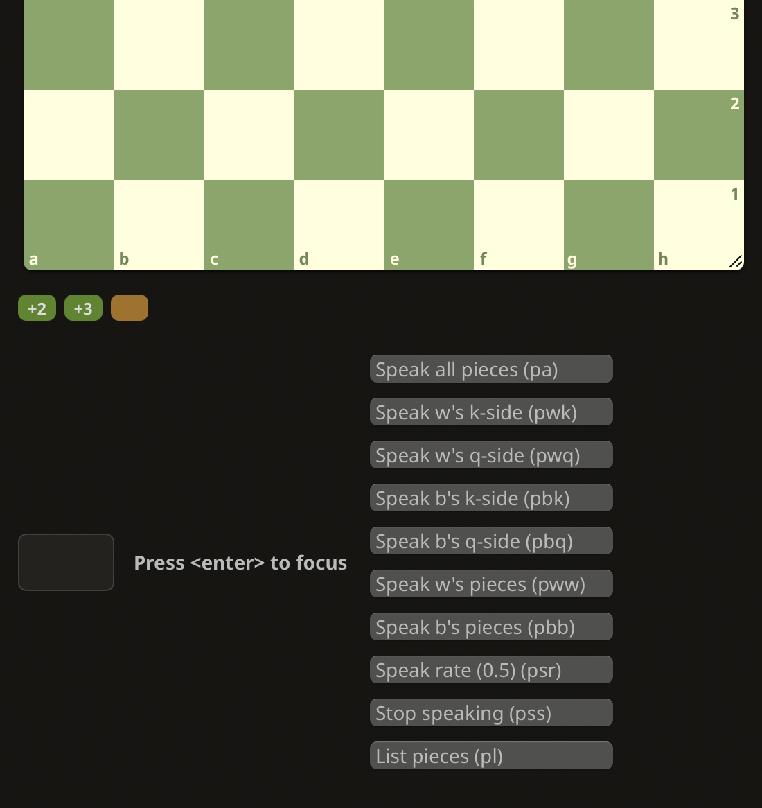

# lichess-utils

## lichess-board-speaker

Script to make it possible to practice blindfold chess puzzles.
- Speaks out the pieces on the board: "white pawns on a2 b2. a1 white rook".
- Supports text input to trigger these commands (desktop).
- Supports buttons to trigger the same commands (mobile, desktop).

### Installation

- install the tampermonkey browser extension (chrome, firefox) or userscripts (safari)
- add [the script code](https://raw.githubusercontent.com/dylan-chong/lichess-utils/refs/heads/main/lichess-board-speaker.js) to the browser extension
- on lichess.org
    - enable keyboard move input
    - you'll probably want to enable move narration
    - go to a puzzle
    - turn on blindfold mode
- type into the move input box `pwk` to read out pieces on the white-kingside quadrant
    - (the 'invalid input' sound plays when you type, but just ignore that sound)
- profit from blindfold chess puzzle practice!
