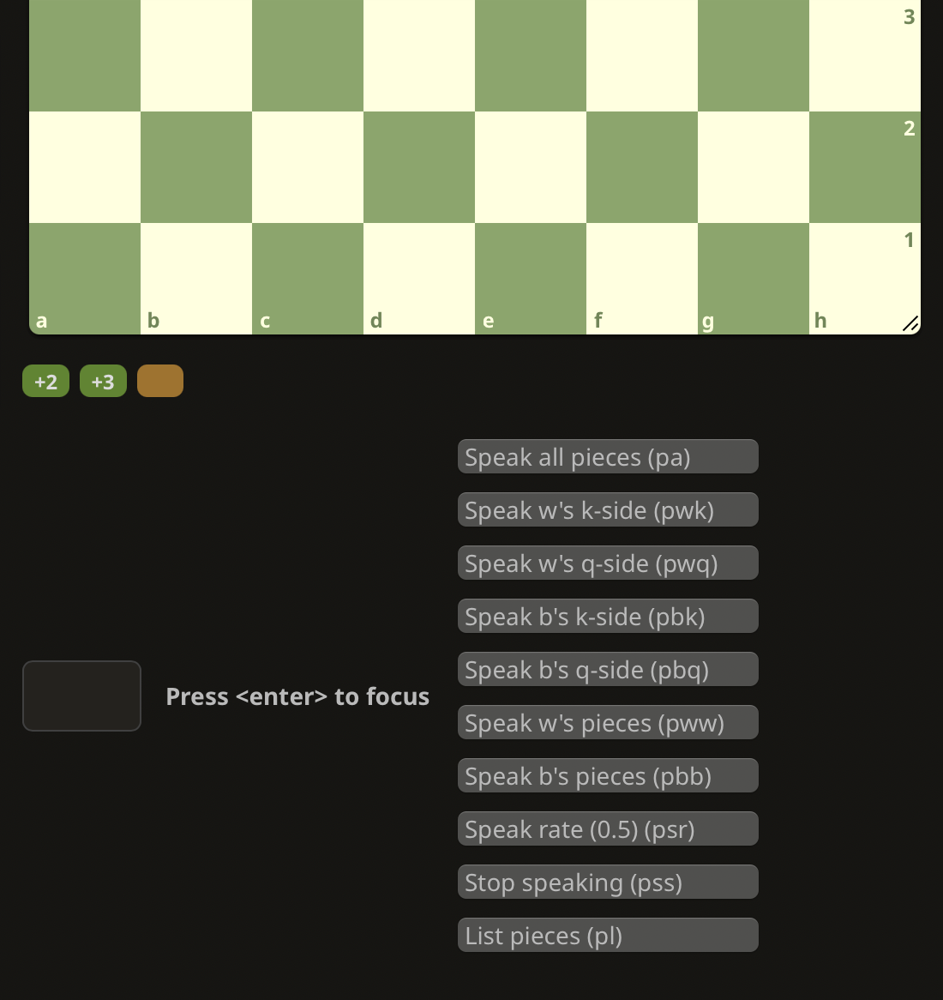

# lichess-utils

## lichess-board-speaker

Script to help you train blindfold chess.

- Speaks out the pieces on the board: "white pawns on a2 b2. a1 white rook".
- Supports text input to trigger these commands (desktop).
- Supports buttons to trigger the same commands (mobile, desktop).
- Supports blindfold game and puzzle training with various semi-blindfold settings

Mobile friendly (browser only of course)



## Architecture Overview

This codebase follows a strict layered architecture with 5 main layers. Each layer has clear responsibilities and can only depend on layers at the same level or below. This ensures modularity, testability, and maintainability.

### Layer Hierarchy (top to bottom)

```
┌─────────────────────────────────────┐
│  Presentation (src/presentation)    │  UI components, rendering
├─────────────────────────────────────┤
│  Application (src/application-*)    │  Orchestration, services, handlers
├─────────────────────────────────────┤
│  Adapters (src/adapters-*)          │  Platform API wrappers
├─────────────────────────────────────┤
│  Domain (src/domain)                │  Pure business logic
├─────────────────────────────────────┤
│  Platform (src/platform)            │  Browser APIs (DOM, Storage, etc.)
│  Constants (src/constants)          │  Static configuration
└─────────────────────────────────────┘
```

### Layer Descriptions

#### 1. Platform Layer (src/platform)
- **Purpose**: Direct wrappers around browser APIs and external dependencies
- **Examples**: DOM manipulation, Web Storage API, Speech Synthesis API
- **Can import from**: Platform, Constants
- **Cannot import from**: Any higher layers

#### 2. Constants Layer (src/constants)
- **Purpose**: Static configuration, enums, and constant values
- **Examples**: CSS selectors, command names, chess notation
- **Can import from**: Constants only
- **Cannot import from**: Any other layer

#### 3. Domain Layer (src/domain)
- **Purpose**: Pure business logic with no external dependencies
- **Examples**: Chess coordinates, piece grouping, speech text generation
- **Can import from**: Domain, Constants
- **Cannot import from**: Platform, Adapters, Application, Presentation

#### 4. Adapters Layer (src/adapters-*)
- **Purpose**: Wraps platform APIs with application-specific interfaces
- **Examples**: Speech synthesizer, flash overlay, dividers
- **Can import from**: Adapters, Platform, Domain, Constants
- **Cannot import from**: Application, Presentation

#### 5. Application Layer (src/application-*)
- **Purpose**: Orchestrates domain logic and adapters
- **Examples**: Command handlers, board reader, keyboard input, observers
- **Can import from**: Application, Adapters, Domain, Platform, Constants
- **Cannot import from**: Presentation

#### 6. Presentation Layer (src/presentation)
- **Purpose**: UI components and rendering logic
- **Examples**: Preact components, settings context
- **Can import from**: Presentation, Application, Adapters, Domain, Constants
- **Cannot import from**: Root initialization files

### Dependency Rules

Layer boundaries are enforced by a custom linter (`npm run custom-lint`). The linter will fail if any file imports from a layer it's not allowed to depend on.

**Key principles:**
- Lower layers cannot depend on higher layers
- Constants can be used by all layers
- Domain layer is pure business logic (no platform dependencies)
- Root files (src/init.tsx, src/main.tsx) can import from any layer

## Adding New Features

When adding new code to this project, follow these guidelines to maintain the layered architecture:

### 1. Determine the Appropriate Layer

Ask yourself these questions:

- **Is it a constant value or enum?** → `src/constants/`
- **Is it a browser API wrapper (DOM, Storage, etc.)?** → `src/platform/`
- **Is it pure business logic with no external dependencies?** → `src/domain/`
- **Does it wrap a platform API with app-specific behavior?** → `src/adapters-*/`
- **Does it orchestrate domain logic and adapters?** → `src/application-*/`
- **Is it a UI component?** → `src/presentation/`

### 2. Place Files in the Correct Directory

#### Constants (src/constants/)
```typescript
// src/constants/myFeature.ts
export const MY_CONSTANT = 'value'
export enum MyEnum {
  OPTION_A = 'a',
  OPTION_B = 'b',
}
```

#### Platform (src/platform/)
```typescript
// src/platform/myApi.ts
// Wrap browser APIs with simple, testable functions
export function callMyApi(): void {
  window.myApi.doSomething()
}
```

#### Domain (src/domain/)
```typescript
// src/domain/myFeature/logic.ts
// Pure functions, no imports from platform/adapters/application
import { MY_CONSTANT } from '../../constants'

export function calculateSomething(input: number): number {
  return input * 2
}
```

#### Adapters (src/adapters-myfeature/)
```typescript
// src/adapters-myfeature/myAdapter.ts
// Wrap platform APIs with stateful, app-specific behavior
import { callMyApi } from '../platform/myApi'
import { calculateSomething } from '../domain/myFeature/logic'

export interface MyAdapterState {
  value: number
}

export function createMyAdapter(): MyAdapterState {
  return { value: 0 }
}

export function doSomething(state: MyAdapterState): void {
  const result = calculateSomething(state.value)
  callMyApi()
}
```

#### Application (src/application-myfeature/)
```typescript
// src/application-myfeature/myHandler.ts
// Orchestrate domain logic and adapters
import { doSomething } from '../adapters-myfeature/myAdapter'
import type { SettingsStore } from '../application-settings/settingsStore'

export function handleMyFeature(settings: SettingsStore): void {
  // Coordinate multiple adapters and domain logic
}
```

#### Presentation (src/presentation/)
```typescript
// src/presentation/components/MyComponent.tsx
import { useSettings } from '../contexts/SettingsContext'
import { handleMyFeature } from '../../application-myfeature/myHandler'

export function MyComponent() {
  const settings = useSettings()
  return <button onClick={() => handleMyFeature(settings)}>Click</button>
}
```

### 3. Write Tests

Every new file should have a corresponding `.test.ts` or `.test.tsx` file:

```typescript
// src/domain/myFeature/logic.test.ts
import { describe, it, expect } from 'vitest'
import { calculateSomething } from './logic'

describe('calculateSomething', () => {
  it('doubles the input value', () => {
    expect(calculateSomething(5)).toBe(10)
  })
})
```

### 4. Run the Linter

Before committing, verify your changes pass all checks:

```bash
npm test              # Run all tests and checks
npm run custom-lint   # Check layer boundaries
npm run lint          # Run Biome linter
tsc --noEmit         # Type check
```

### 5. Common Patterns

#### Adding a New Command
1. Add command constant to `src/constants/commands.ts`
2. Add domain logic to `src/domain/`
3. Create handler in `src/application-handlers/`
4. Wire up in keyboard input or UI button

#### Adding a New Setting
1. Add setting to `src/constants/settings.ts`
2. Update `src/application-settings/settingsStore.ts`
3. Add UI control in `src/presentation/components/ControlPanel.tsx`

#### Adding a New Browser API
1. Create wrapper in `src/platform/`
2. Create adapter in `src/adapters-*/` if needed
3. Use from application or presentation layer

### Installation

1. Install the [Tampermonkey](https://www.tampermonkey.net/) browser extension (Chrome, Firefox) or Userscripts (Safari)
2. [Click here to install the script](https://raw.githubusercontent.com/dylan-chong/lichess-utils/main/lichess-board-speaker.user.js) — Tampermonkey will prompt you to install it. For Safari, copy the script to your Userscripts directory instead.
3. The script auto-updates when a new version is pushed to this repo
4. On lichess.org:
    - enable keyboard move input
    - you'll probably want to enable move narration
    - go to a puzzle
    - turn on blindfold mode
- type into the move input box `pwk` to read out pieces on the white-kingside quadrant
    - (the 'invalid input' sound plays when you type, but just ignore that sound)
- profit from blindfold chess puzzle practice!
